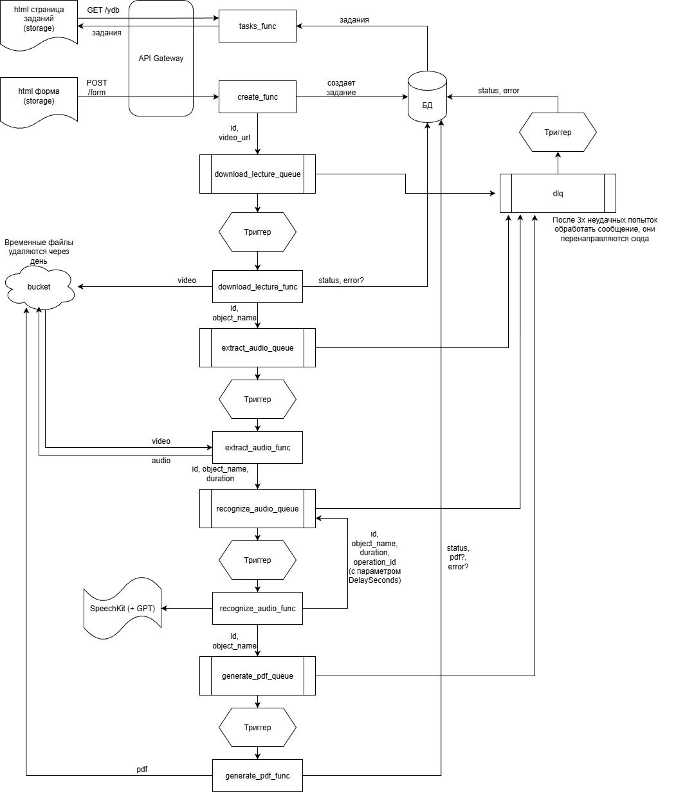

## Запуск
1. chmod +x src/extract_audio/ffmpeg

    chmod +x src/extract_audio/main.sh
2. cd terraform
3. export YC_TOKEN=$(yc iam create-token)
4. ~/terraform/terraform init
5. ~/terraform/terraform apply -var="cloud_id=<cloud_id>" -var="folder_id=<folder_id>" -var="prefix=&lt;prefix>"
    
    https://&lt;api-gw>/form
    тестирование

6. ~/terraform/terraform destroy -var="cloud_id=<cloud_id>" -var="folder_id=<folder_id>" -var="prefix=&lt;prefix>"

## Использованные сервисы
- Yandex Object Storage
- Yandex API Gateway
- Yandex Message Queue
- Yandex Cloud Functions
- Yandex Managed Service for YDB
- Yandex Identity and Access Management
- Yandex Resource Manager
- Yandex SpeechKit
- YandexGPT API (через SpeechKit)

## Архитектура
